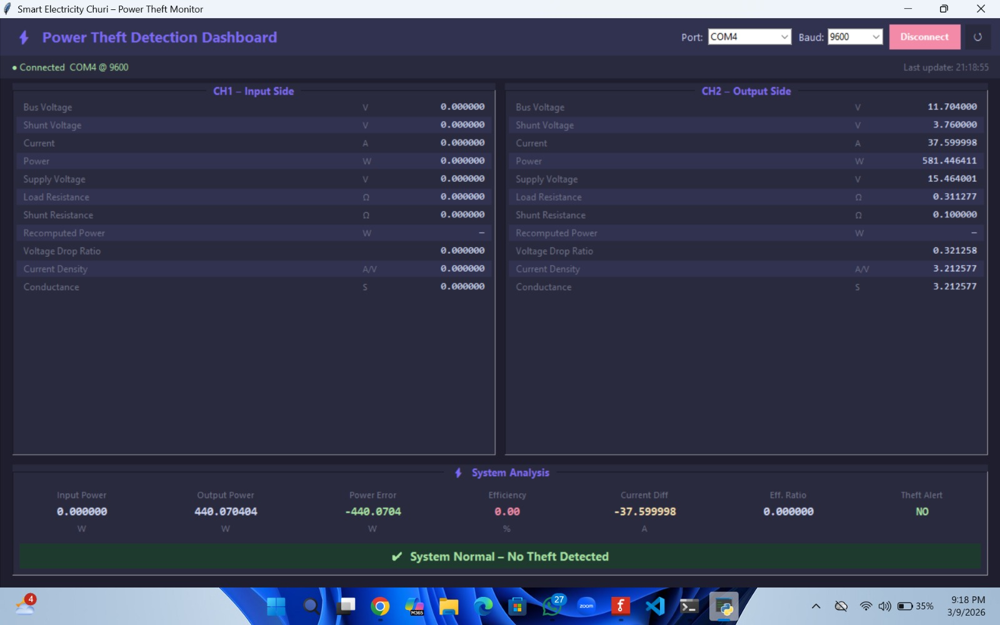
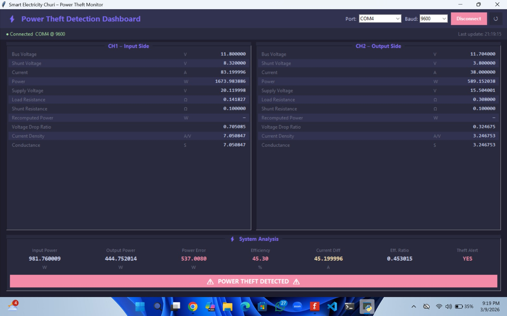

# ⚡ Smart Electricity Churi - Power Theft Monitor


A smart electricity monitoring system designed to detect power theft in real-time. By utilizing an Arduino UNO with the INA3221 voltage/current sensor, the system accurately measures power at the input side and output side of a transmission line. Any significant discrepancy (power loss) between the two ends indicates potential theft or leak, triggering an immediate alert.

The project features a sleek, modern Python-based dashboard that visualizes live metrics such as voltage, current, power, and efficiency in real-time.

---

## 📸 Dashboard Preview

Here is how the monitoring dashboard looks during normal operation and when power theft is detected:

### System Normal


### Power Theft Detected



---

## ✨ Features

- **Real-Time Monitoring:** Dual-channel measurement (Input side vs Output side) for precise analytics.
- **High-Precision Sensors:** Utilizes the INA3221 sensor to monitor bus voltage, shunt voltage, and load current.
- **Instant Alerts:** Automatic theft detection threshold. If the power discrepancy exceeds the configured threshold (`THEFT_THRESHOLD_W`), an alert is triggered (Hardware LED/Buzzer & Dashboard Notification).
- **Advanced Metrics:** Calculates and displays:
  - Bus & Shunt Voltage
  - Current & Power
  - Load & Shunt Resistance
  - Voltage Drop Ratio & Current Density
  - System Efficiency (%)
- **Modern Dashboard:** Built with Python (PyQt/PySide or Tkinter based on your implementation) for an interactive UI with live Serial Data plotting.

---

## 🛠️ Hardware Requirements

- **Arduino UNO** (or compatible board)
- **INA3221** 3-Channel Voltage and Current Sensor Module
- **Shunt Resistor**
- **Connecting Wires** & Breadboard
- **LED / Buzzer** (Connected to Pin 13 for physical alert)

---

## 🚀 Software Requirements

- **Arduino IDE** (To flash the `code.ino` to the Arduino)
- **Python 3.x**
- **Python Packages:** Required packages can vary based on your environment. Typically `pyserial`, `PySide6` or `PyQt5`.

---

## 📂 Project Structure

```text
📦 Smart-Electricity-System
 ┣ 📂 Arduino UNO Code
 ┃ ┗ 📜 code.ino            # The core C++ logic for the Arduino & INA3221
 ┣ 📂 Python Scripts
 ┃ ┗ 📜 dashboard.py        # The desktop GUI app to visualize serial data
 ┣ 📂 ScreenShot            # Example previews of the application
 ┗ 📜 README.md             # This documentation file
```

---

## ⚙️ Setup and Installation

### 1. Hardware Setup (Arduino)
1. Wire the INA3221 sensor to the Arduino via I2C (SDA to A4, SCL to A5).
2. Connect `CH1` of INA3221 to the main input line.
3. Connect `CH2` of INA3221 to the output line.
4. Open `Arduino UNO Code/code.ino` in the Arduino IDE.
5. Install the required `INA3221` library via the Library Manager.
6. Compile and upload the code to your Arduino.

### 2. Software Setup (Dashboard)
1. Ensure your Arduino is connected to your PC via USB.
2. Navigate to the `Python Scripts` directory:
   ```bash
   cd "Python Scripts"
   ```
3. Install the required dependencies:
   ```bash
   pip install pyserial
   # Add additional GUI framework requirements if needed (e.g., pip install PySide6)
   ```
4. Run the dashboard:
   ```bash
   python dashboard.py
   ```
5. Select the appropriate COM Port and Baud Rate (`9600`) in the dashboard to connect!

---

## 📝 License

This project is open-source and available under the MIT License. Feel free to fork, modify, and use it for your own hardware experiments!

## 🤝 Contributing

Contributions, issues, and feature requests are welcome! Feel free to check the issues page.
